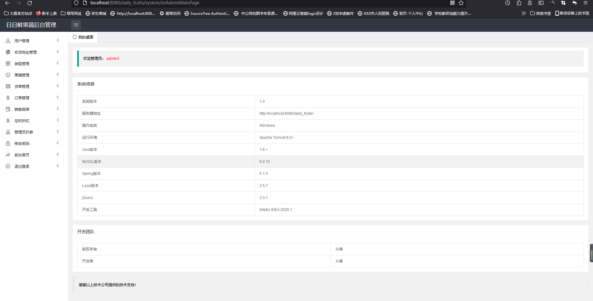
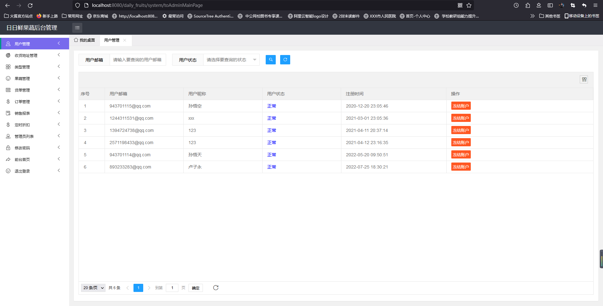
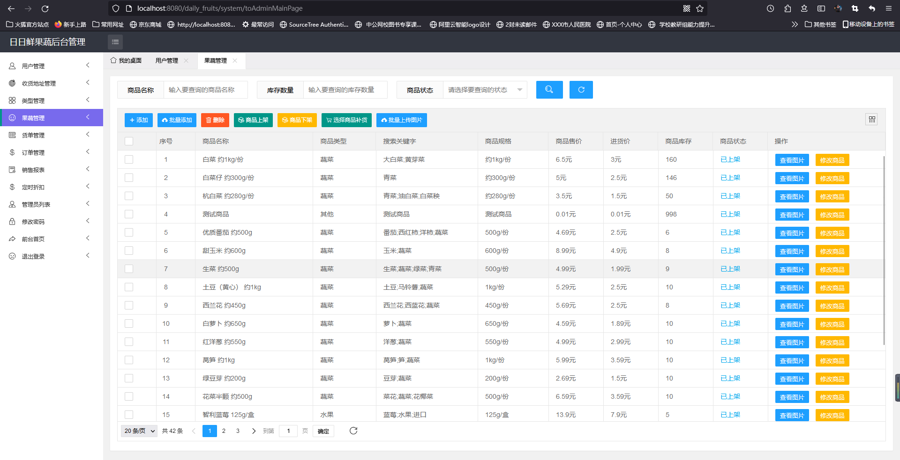
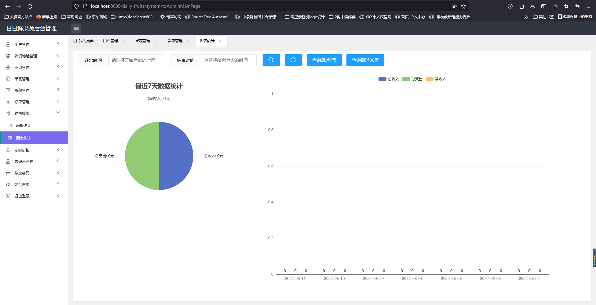
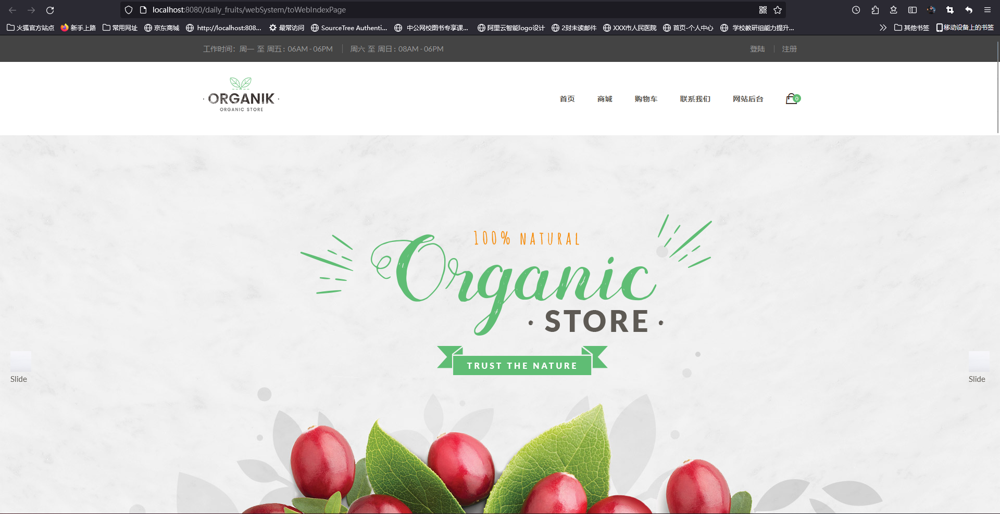
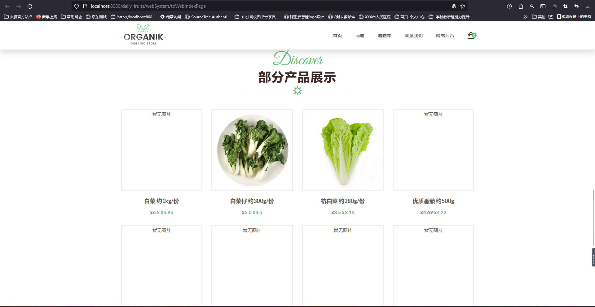
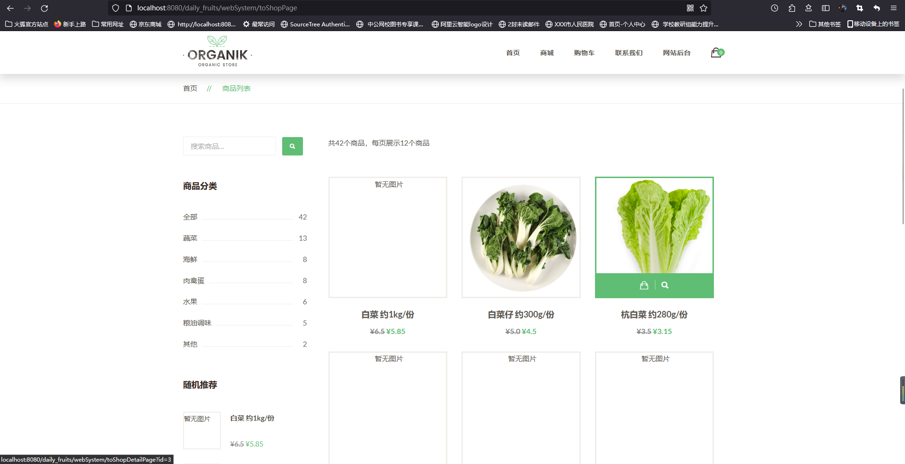

# 基于SSM的商城购物系统

#### 介绍

​	果蔬一直以来是人们必不可少的一个食品之一。果蔬内含有的丰富营养物质对于人类身体而言一直都有强身健体的功效，而且对于人类的口味来说也提供了很丰富的味蕾体验。一直以来，果蔬行业也是国内一直致力于全力发展的重点农业项目。

​	基于此，我开发了一个果蔬商城管理系统，专门用于线上管理和销售果蔬。不仅不受地域的限制，也帮助农民们解决了果蔬销售以及人员管理、销售统计难题。

```

基于SSM的果蔬生鲜超市系统，果蔬商城系统。

前台包含：用户登录、注册、购物车管理、订单管理、收货地址管理、搜索商品信息、下单购物等

后台包括： 用户管理、收货地址管理、类型管理、商品管理、货单管理、订单管理、销售统计、系统管理等模块。
```

#### 系统技术栈

Spring + SpringMVC + MyBatisPlus + JSP + Layui +  jQuery + JavaScript +  MySQL 

#### 仓库代码为压缩版

#### 项目非免费开源，适用于毕业设计，需要请加Q：943701114，非诚勿扰

#### 项目视频地址

https://www.bilibili.com/video/BV1rZ4y187QP?spm_id_from=333.999.0.0&vd_source=eaad2d91b9e5f255962e7c180185d7d9

#### 项目截图

##### 管理员端截图

|  |  |
| ---------------------------------------------- | ---------------------------------------------- |
|  |  |


##### 用户端截图

|  |  |
| -------------------------------------------- | -------------------------------------------- |
|  |  |


#### 参与贡献

1.  斗佛

